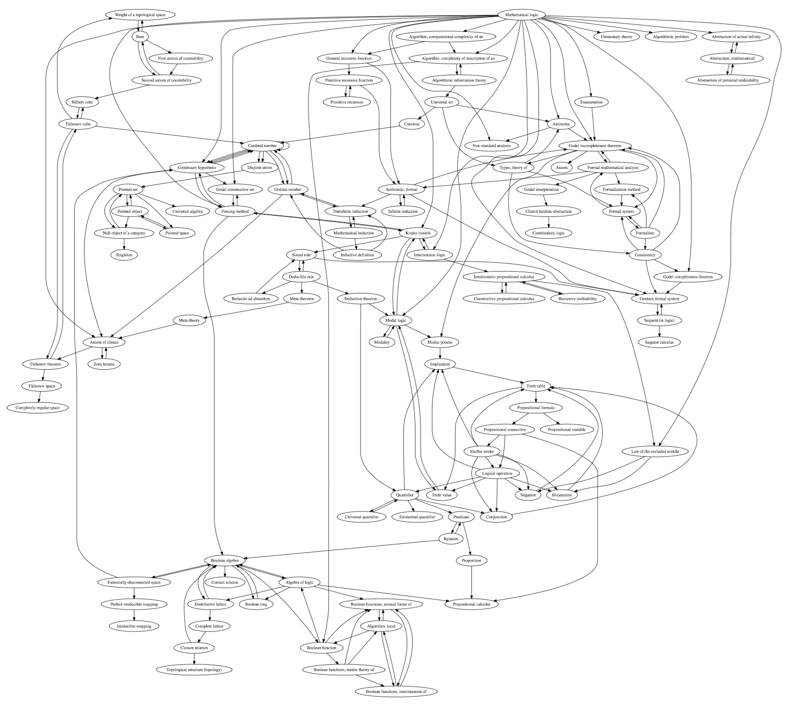

[Automatically Extracted](./https://github.com/jadnohra/defdefqed/blob/master/nlp.py) Knowledge Graphs
----------------------------------------

- [Mathematical Logic](./encycofmath_logic.dot.pdf)
    - 
- [First-Order-Logic](./wikipedia_fol.dot.pdf)
- [Real Analysis](./encycofmath_analysis.dot.pdf)
- [Differential Geometry](./encycofmath_diffgeom.dot.pdf)

defdefqed
---------

1. The __technological singularity is possible__ until proven otherwise.
2. Since the singularity is possible, __it is also inevitable__, given the universe's time-to-live allows.
3. We believe that __no work is useful other than accelerating this inevitability__. At the point of which, we can __all go swimming__.
4. We believe that both non-human and human computers can help the acceleration.
5. We believe that given it is 2018, enlarged mathematics can be in a much better state to support this.
6. We believe that the role of computation, be it calculating Pi or __proving a theorem, will be taken over by non-human computers__.
7. We believe that human computers must all __join forces in enabling non-human computers to take over__ this job.
    1. We know it is against every human computer's nature, aspirations for an illusion of immortality, and individual history to __give up the dream of being the next Euler or Gauss__.
    2. Nevertheless, by 3, it is the only right thing to do.
8. We believe that to achieve 7, we must transform all the heritage of enlarged mathematics __into a form digestible by non-human computers__.
    1. At the same time, we must make non-human computers better at __digesting this heritage in its native form__.
9. To achieve 8. we must all become better and more efficient human computers.
    1. We wish we could delimit the enlarged mathematics that we need to work on to achieve this.
    2. Sadly, this is impossible and so every avenue must be left open. __From the most ultra-finitist approach, to the extremest transfinite and speculative toy problem__.
    3. Having said that, it is important to start bridging all disciplines and topics in our minds for a better chance at breakthroughs.
    4. Because of this, the heritage must also be transformed into a form in which it can be __surveyed at any level of detail and from any angle, residing in a single database of knowledge__. We are __very far from even that__, even though it is __technically possible__. We must __fix this__.
9. We must find the right problems to make our non-human computers work on, they are unable to do it for themselves.
10. We must help non-human computers express themselves such that we understand and can think about what they say, and then together, cooperate on the next results.
11. Enlarged mathematics is a single discipline and it should never have been different. Enlarged mathematics is all of:
    1. _'Abstract' mathematics_
    2. _'Applied' mathematics_
    3. _Computer Science_
    4. _The Natural Sciences_
    5. The science of _education_
    6. The integral _history of all_ of the above
    7. The _philosophy of all_ of the above
12. We are __defdefqed__. Join us.

Compute
-------

 1. I compute because it is possible for me to physically exist and compute.
 2. It is pointless to compute that I can compute (to formalize why I can compute) because the fact that I can compute justifies itself.
 3. My ability to compute is a sequential process.
 4. It matters not if I compute non-sense or not, contradiction or not, mathematics or not. Whatever I compute is computable.
 5. If I so wish, I may compute rules and formalisms. To bootstrap them, I must choose a subset of actions I do for at least one of the symbols of the language, so that I can, when I compute, manipulate the formalism, compute with it.
 6. Mathematics happens by computing of the kind mentioned in 5. Hence, it is predicated on the possibility of computation, which by 1. is possible because it happens and for no other real reason.
 7. I can compute a formalism that abstracts the way I compute, but that again is predicated on 1. It cannot be used to justify 1, but it can be used to model it.
 8. By 5. and 6. Mathematics is inescapably bootstrapped by semantic atom. This cannot be circumvented by basing it on a formal model of computation, because that itself, by 5. is bootstrapped by that same semantic atom.
 9. By 8., when formalizing mathematics, per example, on a non-human computer, I must achieve a similar bootstrapping, otherwise 'nothing happens', the formal language is 'dead' since it cannot be manipulated.
 10. This is easy though. The non-human machine exactly like me in 1., can compute because it is possible for it to exist and compute (this includes the possibility of it to consistently compute in a deterministic way).
 11. By the choice in which I build the machine, it will have some form of intrinsic computing capability that will be used to bootstrap the formal system. Canonically, the simplest such capability is the the ability to concatenate bits. This is also called 'counting'. Everything follows from that.
 12. Since everything follows from that, every sequence of computation can be attached to counting. What differentiates every such computation is what it attaches to the 1, to 2, and so on. The essential component of this difference (also called algorithm) is choice. The choice of algorithm.
 13. The choice of algorithm is bootstrapped again by the possibility to exist and compute a finite sequence of symbols, symbols that are linked to the bootstrapping of the computer (human or not), allowing it to manipulate them.
 14. By 13., the process as a whole of all computers (human or not) computing is hence inevitable, a computation which contains choice when seen from the point of view of the 'leaf' computer computing it, the choice of algorithm for it coming from a 'mother' computer, and so on, until the root computer is reached: the universe providing the possibility of computing, where all choices have been turned into inevitabilities.

Compute Physics
--------------

 15. I share my computations such that they can be sensed (seen) by others who also seem to compute. I know this because I have a limited but useful model of what they are and what they do, and when I contrast it to my model of myself, I realize they also compute.
 16. The probability of my existence and act of computation of 'laws of physics' is, based on computations of probability done by others and that I studied (sense) is infinitesimal but not zero.
 17. Everything that is possible must happen, is inevitable.
